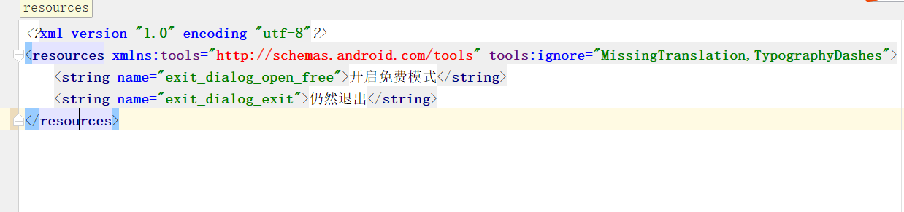
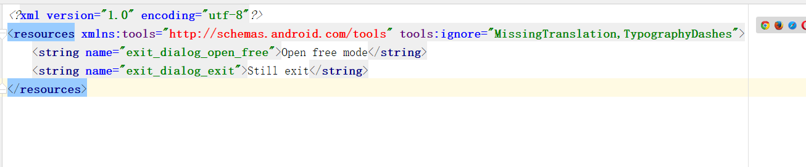

# AndroidStringTranslate2

> Android String.xml  由中文翻译成英文。输入一个android 的String.xml,输出一个out.xml
> 里面的字符串是翻译过的。

# 项目运行截图： #
源文件：

输出文件：

# 使用： #

1.去有道申请APP_KEY ，APP_SECRET
http://ai.youdao.com/

2.替换YouDaoTranslate 类的APP_KEY ，APP_SECRET

3.运行TranslateStringXml的main方法
当然，你需要更改这个方法里面的xml 路径以及输出路径